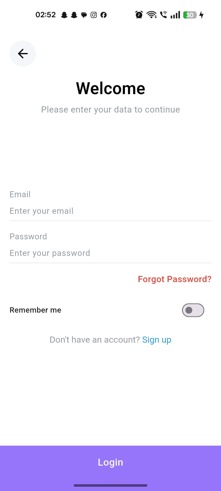
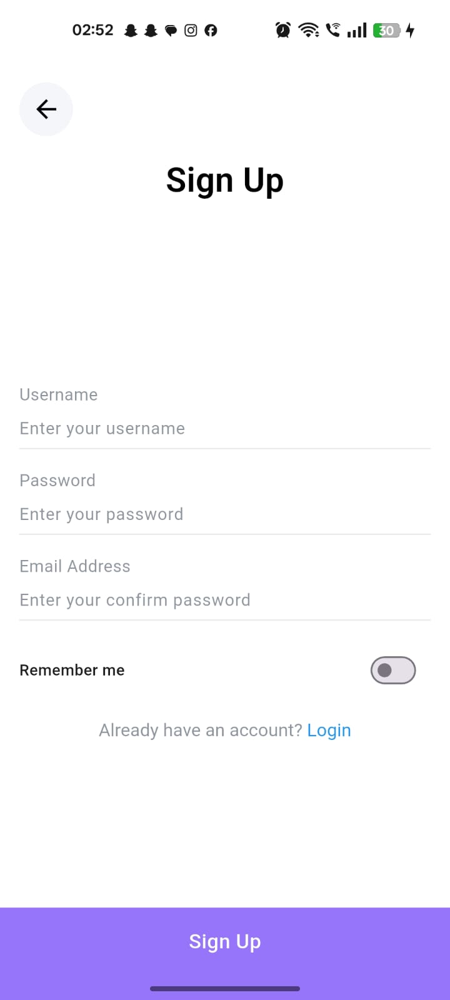
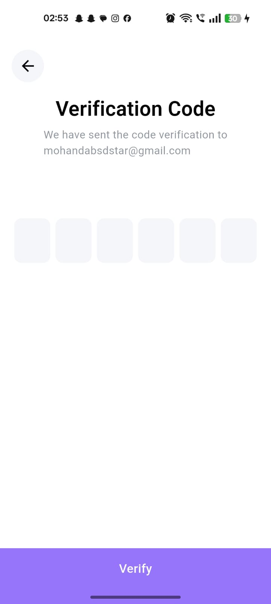
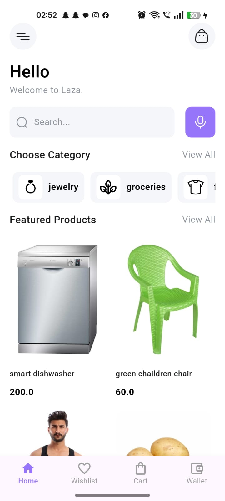
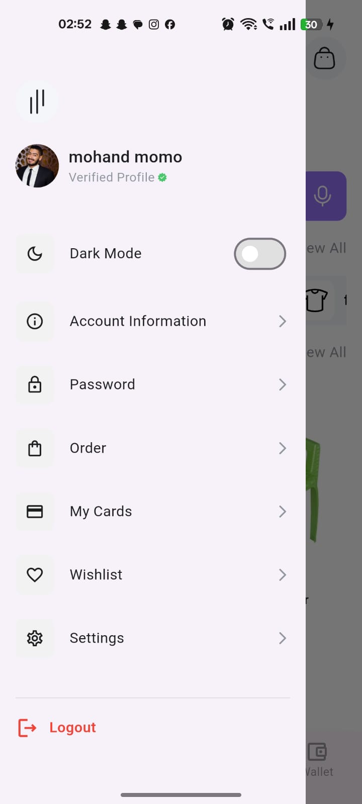

# My App

A simple Flutter app (clean-style architecture) with authentication, categories/products, and a user drawer.

---

## 🔧 Features Implemented
- Authentication flow:
  - Login
  - Sign Up
  - Email Verification
  - Logout
- Home screen: shows Categories and Products
- Drawer: displays user information and navigation

---

## 🌐 Endpoints Used
- `POST /auth/login` — user login
- `POST /auth/register` — user registration
- `POST /auth/verify-email` — email verification
- `POST /auth/logout` — logout
- `GET /categories` — fetch categories
- `GET /products` — fetch products
- `GET /user/profile` — fetch user data for the drawer

---

## 🧱 State Management & Architecture
- State management: **Bloc / Cubit** (all app logic lives in Cubits).  
- Project structure (3 layers):
  - **UI Layer** — screens & widgets  
  - **Logic Layer** — Cubits (state & simple logic)  
  - **Data Layer** — Repositories & API services (network requests)  
- Dependency injection: **get_it**

---

## 🛠 Tech Stack
- Flutter / Dart
- Dio (HTTP client)
- Bloc/Cubit
- json_serializable (for model generation)
- get_it (DI)
- Clean-architecture style (3 layers)

---

## ▶️ How to run the app (simple)
1. Install Flutter SDK and set up Android/iOS toolchains.  
2. Clone the repo:
   ```bash
   git clone <repo-url>
   cd <repo-folder>

## 📱 App Screenshots

| Login Screen | Sign Up Screen | Email Verification |
|---------------|----------------|--------------------|
|  |  |  |

| Home Screen | Drawer Screen |   |
|--------------|----------------|---|
|  |  |   |

